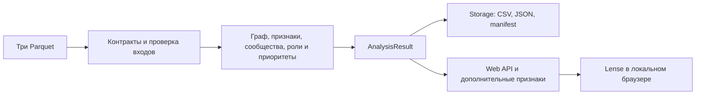

# Граф денег — Lense

**Локальное рабочее место аналитика для исследования сети переводов:** граф, гипотезы ролей, ранжированный список клиентов и объяснение каждого приоритета. Браузерный интерфейс называется **Lense**.

Проект помогает аналитику перейти от списка исходных клиентов к поиску точек консолидации, транзита и распределения средств. Вместо последовательного просмотра всех переводов аналитик получает кандидатов для углублённой проверки, факты по каждому узлу и подсказки о недостающих данных.

**Роли и приоритеты — гипотезы для проверки. Они не устанавливают виновность, управление другими клиентами или происхождение конкретных денежных средств.**

## Что реализовано

- **Загрузка и проверка трёх Parquet.** Сверяются схемы, идентификаторы, суммы, агрегаты операций и глубины от исходных клиентов. Необязательный список `gid` проверяется на совпадение с `is_seed`.
- **Граф переводов.** Направления и объёмы потоков, цвета ролей, раскладка по коленам или кластерам, поиск полного `gid`, фильтры и просмотр соседей выбранного узла.
- **Гипотеза роли каждого клиента.** Консолидация, транзит, распределение, получатель, периферия / граница; отдельно выделяется структурная роль «связующий узел» (`coordinator`).
- **Приоритеты с объяснениями.** Полный ранжированный список и экспорт топ-20. На главном экране выделены кандидаты с признаками консолидации. Поддержка гипотезы роли показана отдельно от приоритета проверки.
- **Временные и структурные признаки.** Сопоставление сумм поступлений и расходов, активность по дням, синхронные поступления, всплески, повторяющиеся маршруты A → B → C, циклы длины 2–3, группы одинаковых сумм и необычные профили относительно своего колена.
- **Сценарий удаления узлов.** Сравнение связности сети до и после удаления топ-N или выбранных клиентов: число компонент и изолятов, крупнейшая группа, оставшийся объём связей.
- **Карточки и список «На проверку».** Потоки, контрагенты, операции, основания роли и ранга, ограничения наблюдения и предлагаемые запросы данных. Выбранный список сохраняется в браузере; справки выгружаются в Markdown и CSV.
- **Проверенные файлы результатов.** Три CSV, граф в JSON и манифест с параметрами и контрольными суммами. CLI публикует комплект атомарно; ошибка новой загрузки в интерфейсе сохраняет прежний расчёт.

## Как работает решение

1. Аналитик открывает набор из `data/` либо загружает `nodes.parquet`, `edges.parquet` и `transactions.parquet` через кнопку **«Загрузить выгрузку»**. При необходимости вставляет список исходных клиентов для сверки.
2. Пайплайн проверяет входы и строит направленный граф. Глубина каждого узла сверяется с кратчайшим направленным путём от любого исходного клиента.
3. Рассчитываются метрики, связные сообщества, временные признаки, роли и приоритеты. Денежные правила работают с целыми тиынами. Для текущего графа посредничество рассчитывается точно.
4. Аналитик изучает граф и приоритеты, открывает карточки и сопоставляет объяснения с операциями. Узлы на границе четвёртого колена отмечаются с учётом обрыва наблюдения.
5. Аналитик добавляет клиентов в **«На проверку»** и скачивает справку с фактами, ограничениями и рекомендациями по следующему запросу данных. Отправку запроса и решение о проверке выполняет сам аналитик.

## Технологии

| Компонент               | Реализация                                                                                                   |
| ----------------------- | ------------------------------------------------------------------------------------------------------------ |
| Язык и локальный сервер | Python 3.14, стандартный `http.server.ThreadingHTTPServer`                                                   |
| Граф и сообщества       | NetworkX: направленный граф, PageRank, посредничество, Louvain с последующим разделением несвязных сообществ |
| Таблицы и вычисления    | pandas, NumPy, SciPy                                                                                         |
| Чтение Parquet          | PyArrow                                                                                                      |
| Интерфейс               | HTML, CSS, JavaScript ES-модули, Canvas 2D; без frontend-фреймворка и обязательной npm-сборки                |
| Форматы результата      | CSV, JSON, Markdown; SHA-256 для контроля входов и комплекта результатов                                     |
| Проверки                | `unittest`, Ruff, mypy для публичных контрактов; workflow GitHub Actions для macOS и Ubuntu                  |

Закреплённые версии — в [requirements.txt](requirements.txt) и [requirements-dev.txt](requirements-dev.txt).

**Обученные AI/ML-модели и LLM не используются.** Роли, объяснения и дополнительные признаки строятся по явным правилам и графовым метрикам. Внешние API, облачные вычисления и API-ключи для работы приложения не нужны. После установки зависимостей интерфейс получает ресурсы и данные с локального сервера, без CDN.

## Архитектура проекта



| Часть                                                   | Ответственность                                                             |
| ------------------------------------------------------- | --------------------------------------------------------------------------- |
| `hackalem/cli.py`, `pipeline.py`, `contracts.py`        | Команды, последовательность расчёта, конфигурация и единый `AnalysisResult` |
| `hackalem/input_contracts.py`, `validation.py`          | Проверка исходных данных и согласованности результатов                      |
| `hackalem/features.py`, `temporal.py`, `communities.py` | Структурные и временные признаки, связные кластеры                          |
| `hackalem/rules.py`, `ranking.py`                       | Правила ролей, факты для объяснений, приоритет и топ                        |
| `hackalem/web.py`, `insights.py`                        | Локальный HTTP API, загрузка, карточки, паттерны и сценарии удаления        |
| `hackalem/storage.py`, `output_store.py`                | Валидация, версии и публикация файлов                                       |
| `web/`                                                  | Интерфейс и отрисовка графа на Canvas                                       |
| `tests/`, `experiments/`, `docs/`                       | Проверки, воспроизводимые эксперименты и подробная документация             |

Интерфейс и CLI используют один расчётный пайплайн. Дополнительные паттерны помогают интерпретации, но автоматически не меняют основную роль или приоритет. Браузерные запросы привязаны к версии набора: смена выгрузки в другой вкладке не смешивает старую таблицу с новой карточкой.

## Установка и запуск

Нужны **CPython 3.14** и современный браузер. Локальная установка проверена на macOS; команды ниже используют POSIX-пути. Файл `.python-version` указывает версию, но сам Python не устанавливает.

### 1. Откройте корень проекта

Это папка с `README.md`, `requirements.txt`, `hackalem/`, `web/` и `data/`. Все следующие команды выполняются **из неё**, а не из `starter/`.

```bash
python3.14 --version
```

### 2. Создайте окружение и установите зависимости

```bash
python3.14 -m venv .venv
.venv/bin/python -m pip install -r requirements.txt
.venv/bin/python -m pip check
```

Если `.venv` уже создано на Python 3.14, повторно создавать его не нужно. Прямой вызов `.venv/bin/python` не требует активации окружения.

### 3. Запустите интерфейс

```bash
.venv/bin/python -m hackalem serve --data data --profile hackalem-july-2026 --port 8765
```

Дождитесь сообщения `Локальный интерфейс: http://127.0.0.1:8765` и откройте **[http://127.0.0.1:8765](http://127.0.0.1:8765)**. Сервер слушает только локальный адрес. Для остановки нажмите `Ctrl+C` в терминале. Если порт занят, задайте, например, `--port 8766` и откройте соответствующий адрес.

При старте читается папка `data/`. Если файлы отсутствуют, интерфейс предлагает загрузить три Parquet. Профиль `hackalem-july-2026` действует и на последующие загрузки: даты должны относиться к июлю 2026 года, каждая операция — составлять не менее 5 000 KZT. Для других периодов предусмотрен `--profile generic`; проверки структуры, сумм и глубин сохраняются.

### Расчёт без интерфейса

```bash
.venv/bin/python -m hackalem analyze --data data --out out --profile hackalem-july-2026
.venv/bin/python -m hackalem validate --data data --out out --profile hackalem-july-2026
.venv/bin/python -m hackalem export --source out --destination reports/portable-result
```

Первая команда создаёт весь комплект, вторая проверяет его, третья копирует проверенную версию в обычную переносимую папку. Для первого расчёта `out` должен отсутствовать; ранее созданный программой комплект можно обновить. Выход не должен пересекаться с входными данными. Для `export` укажите новый, ещё не существующий путь назначения.

| Файл              | Содержание                                                    |
| ----------------- | ------------------------------------------------------------- |
| `nodes_roles.csv` | Все клиенты, роли, признаки, оценки и объяснения              |
| `clusters.csv`    | Размеры, обороты, приоритетные участники и гипотезы кластеров |
| `top_nodes.csv`   | Топ-20 по приоритету с основаниями                            |
| `graph.json`      | Граф и признаки; идентификаторы сохранены строками            |
| `manifest.json`   | Конфигурация и SHA-256 входов и результатов                   |

Те же файлы доступны через кнопку **«Экспорт»** в интерфейсе. При открытии CSV в табличном редакторе импортируйте `gid` **как текст**, чтобы сохранить все цифры.

Прежняя точка входа сохранена: `.venv/bin/python starter/starter.py --data data --out out`.

## Как проверить решение: сценарий для жюри

Используйте три файла из `data/` и параметры запуска выше. На текущем наборе ожидаются:

| Показатель                              |           Значение |
| --------------------------------------- | -----------------: |
| Исходные клиенты (`seed`)               |                 81 |
| Всего клиентов                          |              2 248 |
| Направленные связи                      |              3 119 |
| Операции                                |              4 840 |
| Сумма операций, каждую считаем один раз | 365 890 012,01 KZT |
| Связные кластеры                        |                 89 |
| Клиенты с гипотезой консолидации        |                 87 |
| Строки в `top_nodes.csv`                |                 20 |

Это результаты текущих файлов и закреплённой конфигурации, а не оценка точности выявления нарушений. В интерфейсе денежная сводка округлена до **365,9 млн ₸**.

1. Откройте **«Обзор сети»** и сравните сводные показатели с таблицей. Переключите граф между связями выбранного клиента и всей сетью, затем попробуйте раскладку по кластерам.
2. Найдите полный `gid` **`100000003701161100`**. В карточке должны быть признаки консолидации, **4 плательщика**, **3 получателя** и приоритет около **92,9 / 100**. Получено **1 527 103 KZT**, отправлено **349 000 KZT** — около **22,9%** наблюдаемого входа. Карточка показывает округлённые суммы; операции и справка позволяют проверить их подробнее.
3. Откройте **«Операции»** и **«Что запросить дальше»**. Добавьте клиента в проверку, перейдите в **«На проверку»** и скачайте справку: она должна содержать тот же `gid`, основания и ограничения.
4. В разделе **«Приоритеты»** включите отбор консолидации. В **«Паттернах»** откройте маршрут или цикл и посмотрите факты и оговорки. В **«Устойчивости»** рассчитайте удаление топ-5 и сравните показатели до и после.
5. Через **«Загрузить выгрузку»** выберите все три исходных Parquet. Дождитесь успешного расчёта и проверьте, что показатели сохранились. Для проверки ошибки можно повторить загрузку, указав только `123` в списке seed: программа должна сообщить о несовпадении и сохранить предыдущий результат.
6. Выполните CLI-команды `analyze` и `validate` из раздела выше. Валидатор должен сообщить, что проверка готовых выгрузок пройдена; в `out/` должны быть пять перечисленных файлов.

### Автоматические проверки

```bash
.venv/bin/python -B -m unittest discover -s tests -v
.venv/bin/python -O -B -m unittest discover -s tests -v
```

Проверяются денежные границы, глубины, FIFO, связность кластеров, целостность CSV/JSON, ошибки публикации, паттерны, API, загрузка и версии данных. Настройка Ruff, mypy и команды разработки описаны в [docs/development.md](docs/development.md). [Workflow CI](.github/workflows/checks.yml) настроен для macOS и Ubuntu; наличие конфигурации не означает, что удалённый прогон уже завершился успешно.

## Данные и интеграции

Источник расчёта — **локальные обезличенные файлы `data/`**. Входная схема:

| Файл                   | Столбцы                                  |
| ---------------------- | ---------------------------------------- |
| `nodes.parquet`        | `gid`, `depth`, `is_seed`                |
| `edges.parquet`        | `src`, `dst`, `sum_kzt`, `n_tx`, `depth` |
| `transactions.parquet` | `src`, `dst`, `date`, `sum_kzt`          |

Период текущих операций — **1–31 июля 2026 года**. Распределение клиентов по глубине 0 / 1 / 2 / 3 / 4: **81 / 472 / 462 / 789 / 444**. Дальнейшие связи исследуются по направлению исходящих переводов от seed; полнота входящих потоков исходных клиентов не предполагается.

`gid`, `src` и `dst` во входных Parquet должны быть точными `int64`; суммы — положительными, не более двух десятичных знаков. Узлы и агрегированные пары уникальны, концы рёбер известны, агрегаты согласованы с транзакциями. В браузерном API идентификаторы и целые денежные суммы в тиынах передаются строками. Подробности — в [контрактах данных](docs/methodology.md#контракты-исходных-данных).

Интеграция интерфейса с Python выполнена через локальный HTTP API: `/api/bootstrap`, `/api/nodes/<gid>`, `/api/analyze`, `/api/jobs/<job_id>`, `/api/resilience`, `/api/export` и `/api/download/<filename>`. Контракты запросов описаны в [документации API](docs/development.md#локальный-интерфейс-и-api).

Подключения к банковской системе или системе правоохранительных органов в коде нет: подготовку выгрузки и дальнейшую передачу справки выполняют вне приложения. ФИО, ИИН и номера счетов не требуются; браузерная загрузка отклоняет дополнительные столбцы вне указанной схемы.

## Ограничения текущей версии

- **Неполная наблюдаемость.** Выборка ограничена периодом, исходными клиентами и четырьмя коленами. Начальные остатки, внешние счета и операции вне выгрузки неизвестны. Отсутствие исходящих связей на четвёртом колене не подтверждает конечного получателя.
- **Нет точного порядка внутри дня.** FIFO сопоставляет доступные суммы предыдущих дней, расходуя каждое поступление один раз. Операции одного дня отмечаются как неопределённые. Совпадение сумм или наличие цикла не доказывает движение тех же денег.
- **Эвристики без размеченной выборки.** Поддержка роли не является вероятностью нарушения, а приоритет задаёт порядок изучения. В репозитории нет оценки качества по размеченным расследованиям и измерения экономии времени аналитика. Самопереводы не увеличивают сетевой приоритет.
- **Границы вычислений.** При превышении 5 000 узлов или 50 000 рёбер число источников ограничивается 256; если это все узлы графа, расчёт остаётся точным. Поиск паттернов и выдача примеров ограничены; фокусный граф показывает до 180 узлов. Интерфейс сообщает об усечении. Полный перечень порогов — в [методике](docs/methodology.md).
- **Сценарий удаления — структурный.** Новые маршруты и изменение поведения клиентов не моделируются; объём удалённых связей нельзя интерпретировать как предотвращённый ущерб.
- **Лимиты входа.** Браузер принимает до 64 МиБ трёх файлов суммарно, до 20 000 узлов, 200 000 рёбер и 1 000 000 операций; предел распакованного размера по метаданным Parquet — 512 МиБ. Для формирования обязательного топ-20 нужен набор минимум из 20 клиентов. Эти лимиты не гарантируют одинаковую скорость на любых графах.
- **Локальная сессия.** Новый загруженный набор хранится в памяти до перезапуска сервера; исходный `data/` не изменяется. Список проверки хранится в `localStorage` отдельно для каждого набора. Нет учётных записей, разграничения прав и общего хранилища дел; сервер предназначен для локальной работы.
- **Платформы.** Локальная проверка описана для macOS. Матрица CI содержит Ubuntu и macOS, но успешный удалённый прогон здесь не заявлен. Публикация файлов использует POSIX-механизмы; работа в Windows не подтверждена.

## Демо и публикация

Подтверждённой ссылки на публично развёрнутую версию приложения в проекте нет. Рабочий вариант запускается локально: **[http://127.0.0.1:8765](http://127.0.0.1:8765)** после команды `serve`.

[Визуальный референс Lense](https://freedom-money-graph-demo-0248.duisetn.chatgpt.site) использован при адаптации интерфейса. Это ссылка на исходный макет, а не подтверждение публикации текущего Python-приложения и его расчётов.

## Подробная документация

- [Методика](docs/methodology.md): правила, точность сумм, полнота наблюдения, паттерны и контракты хранения.
- [Разработка](docs/development.md): архитектурные границы, API, окружение, проверки и совместимость CLI.
- [Эксперименты](docs/experiments.md): измерения производительности, аудит и сравнение Louvain/Leiden. Leiden остаётся экспериментом и не используется в основном расчёте.
