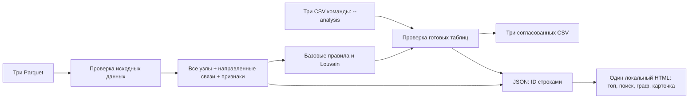

# Интерфейс «Граф денег»

Ветка `interface` закрывает сценарий: **топ клиентов → поиск по gid → направленные
связи → числовое объяснение роли и приоритета**. Топ по умолчанию содержит 50 клиентов
из реального датасета, а поиск доступен по всем 2 248, включая 19 изолированных.
Числа не зашиты в интерфейс: при смене данных они пересчитываются.

## Запуск

Из корня репозитория в существующем Python-окружении команды:

```bash
python run.py
```

Откройте `out/index.html` обычным двойным щелчком. HTML самодостаточен: сервер,
интернет, npm, платные API и CDN для работы интерфейса не нужны.
При просмотре HTML на GitHub виден исходный текст; запускайте локальный файл.

Альтернативное проверенное окружение — Python 3.12 (macOS arm64):

```bash
python3.12 -m venv .venv
.venv/bin/python -m pip install -r requirements-interface.txt
.venv/bin/python run.py
```

Зависимости исходного starter для Python 3.14 оставлены в `starter/requirements.txt`.
Новый набор проверен отдельно; запуск интерфейса в окружении 3.14 не проверялся.
Не смешивайте два набора зависимостей в одном окружении.

Параметры запуска:

```bash
python run.py --data data --out out --top 50
```

`--top` — не меньше 20. Если клиентов меньше 20, запуск сообщает ошибку: строки
не дублируются ради минимального количества. Повторный запуск перезаписывает результаты
в выбранной папке `--out`. Папка создаётся автоматически; стандартные пути привязаны
к расположению `run.py`, поэтому команда не зависит от текущей рабочей папки.

Результаты:

| Файл | Содержимое |
|---|---|
| `out/top_nodes.csv` | Топ 50: rank, gid, role, priority_score, why |
| `out/nodes_roles.csv` | Роли, оценки, кластеры, evidence и признаки всех клиентов |
| `out/clusters.csv` | Размеры сообществ, seed, внутренний оборот, лидеры, гипотезы |
| `out/graph.json` | Согласованные данные для интерфейса со строковыми ID |
| `out/index.html` | Готовый автономный интерфейс с включёнными данными |

В CSV `gid` сохраняется точным целым десятичным текстом. При импорте в Excel выберите
для этой колонки тип **текст**, иначе Excel может округлить 18-значные значения.
В JSON все `gid`, `src`, `dst`, включая топ, — строки. В браузере они никогда не
преобразуются в числа. Пропущенные числовые значения кодируются `null`.

`starter/starter.py` сохраняет прежний учебный режим с пустыми шаблонами. Для
**готового топа и интерфейса используйте `run.py` из корня**, а не создание шаблонов.

## Как пользоваться

1. Откройте HTML. Слева расположен топ по убыванию приоритета, справа карточка первого клиента.
2. Введите полный `gid` или его часть. Поиск охватывает всех клиентов, включая клиентов
   вне топа. Точное совпадение полного ID снимает фильтры кластера и роли.
3. Нажмите на клиента: граф покажет его отправителей слева и получателей справа.
   Стрелки показывают направление денег; при переводах в обе стороны видны две стрелки.
4. Контрагенты сортируются по общей сумме переводов с выбранным клиентом.
   На странице максимум 10 контрагентов. Кнопки «Далее/Назад» позволяют просмотреть
   **все прямые связи**, в том числе у клиента со 116 получателями. Таблица под графом
   показывает суммы и количество операций той же страницы. Связи между показанными
   соседями также отображаются. Связи между соседями на разных страницах не показаны;
   для дальнейшего исследования перейдите к одному из этих клиентов.
5. Клик по узлу, ID в таблице или контрагенту в карточке открывает его собственное окружение.
   Enter/Space на узле тоже работают. Полный ID есть в карточке, таблице и подсказке;
   сокращённые метки на графе используют уникальные суффиксы.
6. Фильтры кластера и роли действуют на список. Связи выбранного клиента с другими
   кластерами сохраняются на графе. В списке можно переключиться с топа на всех клиентов.
7. Цвет можно переключить с роли на кластер. Пунктир означает границу четвёртого колена,
   S — исходного клиента. «Как это работает» содержит объяснение и скачивание топа.

Для первого экрана используется окружение выбранного узла. Отрисовка всех 2 248 узлов
одновременно не реализована. Поиск и последовательные переходы доступны по всей сети.

## Подключение аналитики участников 1–2

Интерфейс не требует ожидать готовую аналитику: без дополнительных параметров запускается
отдельный модуль `baseline.py`. Это исходная версия объяснимых правил, а не обученная модель.

Когда команда подготовит три согласованных CSV, передайте их папку:

```bash
python run.py --analysis path/to/team-results --out out-team
```

Должны присутствовать `nodes_roles.csv`, `clusters.csv`, `top_nodes.csv` по контракту
`starter/validation.py`. Импорт сначала проходит строгую проверку, включая покрытие
всех клиентов, диапазоны оценок, минимум 20 уникальных строк топа, сортировку,
согласованность ролей, приоритетов и кластеров. Пустые шаблоны отклоняются.
При импорте роли, кластеры, оценки и топ сохраняются, повторного скоринга нет.
`--top` применяется только к baseline. Наблюдаемые суммы, степени и пограничный
признак пересчитываются из Parquet, чтобы карточки не зависели от устаревших признаков.

Текст `why` из топа показывается в карточке как основание приоритета. Для остальных
клиентов можно передать дополнительную колонку `priority_reason`; при её отсутствии
интерфейс прямо сообщает, что объяснение для клиента вне топа не передано.
В JSON `meta.analysis_source` равен `baseline_rules_v1` или `team_csv`; источник
виден и на экране.

## Базовая аналитика: объяснимые допущения

В граф включаются все узлы. Для кластеризации строится неориентированная проекция,
в которой встречные суммы складываются. Louvain: `weight=weight`, `resolution=1`,
`threshold=1e-7`, `seed=42`. Узлы и рёбра сначала сортируются; сообщества нумеруются
по убыванию размера, затем по минимальному gid. Изолированные узлы получают собственные
кластеры. Фиксация параметров даёт повторяемость в том же окружении, но не доказывает
устойчивость сообществ. Кластер не равен преступной организации.

Дополнительные признаки:

- `seed_reach`: число разных seed, от которых клиент достижим по направлению переводов
  не более чем за четыре ребра. Сам клиент как собственный seed не учитывается.
- `betweenness`: точное нормированное посредничество в направленном графе; расстояние
  равно числу рёбер, сумма перевода не используется как расстояние.
- `neighbor_clusters`: число разных кластеров среди входящих и исходящих соседей.
- `in_concentration`: доля крупнейшего отправителя во входящей сумме; диагностическая
  колонка, в текущую формулу приоритета не входит.

Обозначим `I/O` — число входящих/исходящих связей, `p = out_kzt / in_kzt`,
`S = seed_reach`. Правила применяются сверху вниз; первая подходящая роль побеждает:

| Условие | Роль | role_score |
|---|---|---|
| Колено 4 и O=0 | peripheral, роль неопределённа | 0.20 |
| I+O=0 | peripheral, недостаточно данных | 0.10 |
| I≥3, O≥3, S≥2, ≥2 кластера соседей, betweenness>0 | coordinator | min(0.90, 0.45+0.3×(min(I,O)/10+min(S,5)/10)) |
| I≥3 и p≤0.5 | consolidator | min(0.90, 0.50+0.2×min(I/10,1)+0.2×(1−p)) |
| O≥5 и O≥2I | distributor | min(0.90, 0.50+0.4×min(O/20,1)) |
| I>0, O>0, 0.8≤p≤1.2 | transit | 0.50+0.30×(1−abs(1−p)/0.2) |
| I>0 и O=0 | terminal в пределах наблюдения | 0.55 |
| Остальные | peripheral, пороги не достигнуты | 0.30 |

`role_score` — сила соответствия правилу, **не статистически калиброванная уверенность**.
При отсутствии входа `p` неопределено, правила по отношению сумм не срабатывают.
Периферия также используется для неопределённых случаев, поскольку в ТЗ допустимы
только шесть ролей. Это явно отмечается в evidence и ограничениях карточки.

Приоритет рассчитывается независимо от роли:

```text
L(x) = log(1+x) / max(log(1+x)) по всем клиентам, либо 0 при нулевом максимуме
B(x) = x / max(x), либо 0 при нулевом максимуме
priority = 0.35 × L(in_kzt + out_kzt)
         + 0.25 × L(in_deg + out_deg)
         + 0.25 × L(seed_reach)
         + 0.15 × B(betweenness)
```

Результат округляется до шести знаков и находится в 0–1. При равенстве используется
gid по возрастанию. Список содержит наибольшие приоритеты. `why` показывает реальные
значения четырёх признаков, `evidence` — числовое основание роли до 200 символов.
Изолированные клиенты имеют нулевой приоритет, но остаются доступными для поиска.
Ни один конкретный gid не зашит в правила или демонстрационные кнопки.

Пороги и веса — экспертные стартовые допущения. Нет размеченной выборки, измеренной
точности или подтверждения движения тех же средств. Временная последовательность
операций не анализируется; близость входящих/исходящих сумм сама по себе не доказывает
транзит. Seed и высокая связность сами по себе не доказывают нарушение.

## Архитектура



## Проверки

Из корня в активном окружении:

```bash
python -B -m unittest discover -s tests -v
cd starter
python -B -m unittest discover -s tests -v
```

6 новых проверок: реальный датасет и топ, воспроизводимость при перестановке входных
строк, запуск и импорт CSV команды, отклонение пустых шаблонов, безопасное встраивание
текста в HTML, запрет топа меньше 20. Все 25 исходных тестов также проходят.
Строгая проверка CSV выполняется до записи и после чтения сохранённых файлов.

Дополнительная проверка поведения интерфейса требует Node.js и jsdom (только для
разработчиков; для пользователей сайта они не нужны):

```bash
npm install --no-save jsdom@30.1.1
node tests/interface-dom.cjs out/index.html
```

Проверены точные длинные gid, клиенты вне топа, пустой поиск, роли и кластеры,
пограничные/изолированные клиенты, все 116 контрагентов через 12 страниц, направления
стрелок, выбор с клавиатуры, смена цветов и обработчик скачивания. Ошибок JavaScript
в DOM-симуляции не обнаружено. Реальный браузер в среде разработки не запустился
из-за ошибки sandbox; визуальная проверка CSS и мобильного отображения не выполнена.

Контрольный запуск: 2 248 клиентов, 3 119 рёбер, 91 кластер, топ 50, около 1.5–2 секунд
после установки зависимостей. Скорость измерена на текущем Mac, не является гарантией
для любого компьютера. Для миллиона узлов текущая реализация не предназначена.

## Сценарий защиты на пять минут

1. **0:00–0:45:** показать данные и непустой топ; объяснить, что приоритет — очередь проверки.
2. **0:45–1:45:** открыть первого клиента, сопоставить числовое `why` со связями и суммами.
3. **1:45–2:45:** найти клиента по полному gid, перейти по стрелке к контрагенту.
4. **2:45–3:30:** показать страницы графа и фильтр кластера; переключить цвет на кластер.
5. **3:30–4:15:** кнопками примеров открыть границу 4-го колена и клиента без связей.
6. **4:15–5:00:** показать команду запуска, выгрузки и заменяемую аналитику через `--analysis`.

AI-агент использован при разработке кода, тестов и интерфейса. Во время работы
приложения обращения к LLM или внешним сервисам отсутствуют.
